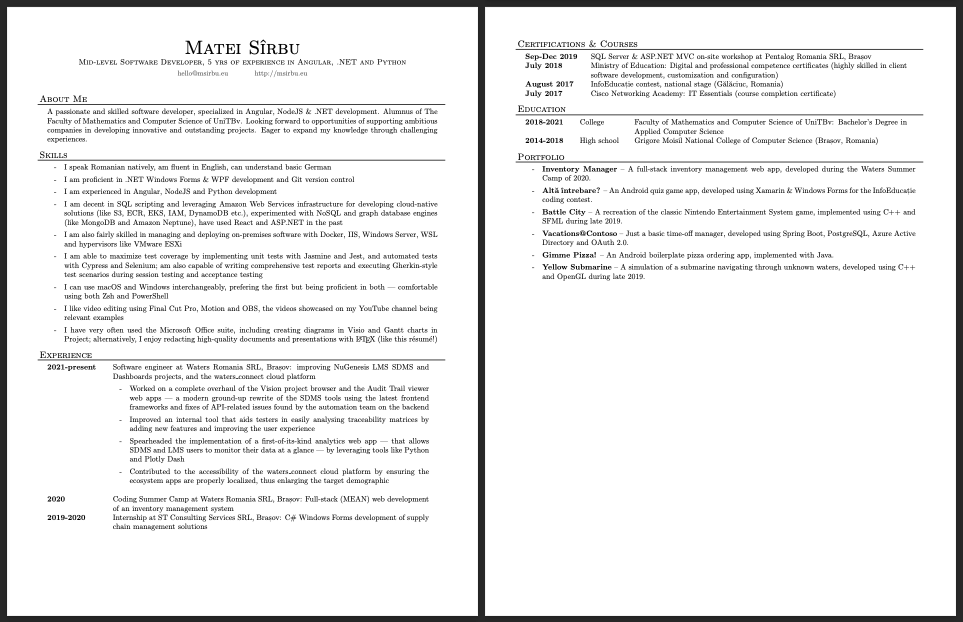
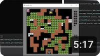
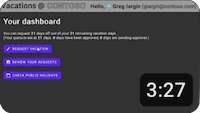
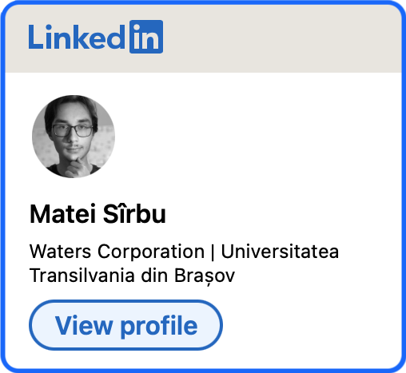

👋&nbsp;&nbsp;**I'm Matei** — a passionate and skilled software developer, with 5 years of experience under my belt of mastering _Node.JS_, _.NET_ and _Python_ frameworks. Always eager to support ambitious companies in developing innovative and outstanding solutions, and to expand my knowledge through challenging experiences.
___

### 🧰&nbsp;&nbsp;My tech stack:

                  

### 📜&nbsp;&nbsp;More about myself:

### 📺&nbsp;&nbsp;Stuff I've been up to:

|
🌊&nbsp;&nbsp;Animating a deep dive with [_OpenGL_](https://en.wikipedia.org/wiki/OpenGL)
|
🕹️&nbsp;&nbsp;Remaking a retro game with [_SFML_](https://en.wikipedia.org/wiki/Simple_and_Fast_Multimedia_Library)
|
🏖️&nbsp;&nbsp;Time off management solution with [_PostgreSQL_](https://en.wikipedia.org/wiki/PostgreSQL) and [_Microsoft Entra ID_](https://en.wikipedia.org/wiki/Microsoft_Entra_ID)
|
|---|---|---|
|

|

|

<table style="width: 100%; border: none;">
    <tr>
        <td valign="top">
            
        </td>
        <td valign="top">
            <h3>📨&nbsp;&nbsp;Let's keep in touch!</h3> 
            
        </td>
    </tr>
</table>